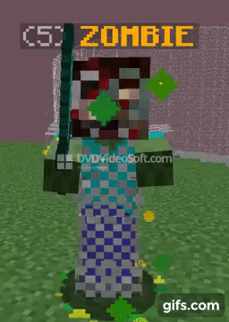

# My Work

## Minecraft:

### Public Projects

---

 

**Name**: LockedDimension

**Description**: You could disable, lock dimensions behind permissions nodes, and much more. all within a single plugin.​

**Version Supported**: 1.8.9 - 1.16.X

--- 

**Available at**: [Spigot](https://www.spigotmc.org/resources/lockeddimension-1-8-8-1-16-3-have-freedom-over-your-dimensions.84331/)

**Source at**: [GitHub](https://github.com/Tofpu/LockedDimension)

---

**Name**: MobPreventer

**Description**: A plugin which its purpose is to prevent certain mobs from spawning into your world.​

**Version Supported**: 1.8.8 - 1.16.X

---

**Available at**: [Spigot](https://www.spigotmc.org/resources/mobpreventer-1-8-8-1-16-3-prevent-mobs-from-spawning-into-your-world.84308/)

**Source at**: [GitHub](https://github.com/Tofpu/MobPreventer)

---

**Name**: EntityRiding

**Description**: Gives the players the ability to ride on entities. such as mobs, creatures, players. etc etc.​

**Version Supported**: 1.8.8 - 1.16.X

---

**Available at**: [Spigot](https://www.spigotmc.org/resources/entityriding-1-8-8-1-16-3-let-your-players-enjoy-the-view.84332/)

**Source at**: [GitHub](https://github.com/Tofpu/EntityRiding)

---

**Name**: ExtraLobby

**Description**: An addon to bundle with your already existing lobby plugin!

**Version Supported**: 1.8.8 - 1.16.X

---

**Available at**: [Spigot](https://www.spigotmc.org/resources/extralobby-1-8-8-1-16-4-an-addon-for-lobby-plugins.87363/)

**Source at**: [GitHub](https://github.com/Tofpu/ExtraLobby)

---

### Private Projects

---
### Zombie:
**Description**: A cool particles + randomized head showcase!

---

### Doubloon:
**Description**: A balance based plugin.

---

### Private Message:
**Description**: A private message system.

---

## Discord Bots
### Private Projects
---
### Search:
**Function**: The ability to search gifs on Giphy.

---
### Lookup:
**Function**: The ability to lookup Minecraft IGN's

